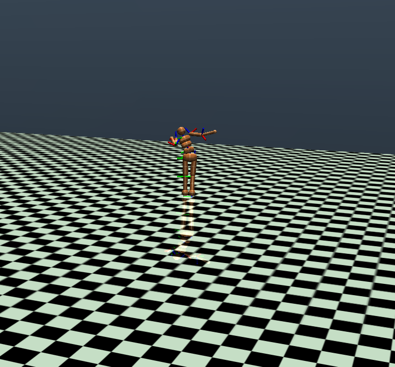

# A Survey on Different Methods Applied in Humanoid Deep Reinforcement Learning

> This is the final project for the course "Deep Reinforcement Learning" at the National Tsing Hua University.
> The goal of this project is to train an agent to solve [the MuJuCo Humanoid environment](https://gymnasium.farama.org/main/environments/mujoco/humanoid/).



## Requirements

```setup
# python >= 3.8 or <= 3.11 is required
conda create -n humanoid python=3.11 -y
conda activate humanoid

# install pytorch as per your operating system, the below command applies to Linux
conda install pytorch pytorch-cuda=12.1 -c pytorch -c nvidia -y
pip3 install "gymnasium[mujoco]" "stable-baselines3[extra]" tensorboard numpy
```

### Fix MuJuCo Rendering Bug (Needed if you want to render the environment)

In `$CONDA_PATH/envs/humanoidrun -n libpython3.11/site-packages/gymnasium/envs/mujoco/mujoco_rendering.py`, there is an bug relating to the rendering of the MuJuCo environment.
To fix this bug, you need to replace the following code in line 592:

- Before:

    ```python
            self.add_overlay(
                bottomleft, "Solver iterations", str(self.data.solver_iter + 1)
            )
    ```

- After:

    ```python
            self.add_overlay(
                bottomleft, "Solver iterations", str(self.data.solver_niter + 1)
            )
    ```

After this fix, the rendering of the MuJuCo environment should work properly.

## Training

```train
conda activate humanoid && python3 train.py <options...>
```

### Options

- `-h`, `--help`

    Show help message and exit

- `-t`, `--timesteps`: `[int]`

    The total number of timesteps to train for. (Default: `5_000_000`)

- `--no-wrapper`

    Disable the wrapper for the environment. (Default: `False`)

- `-a`, `--algo`: `["sac","ppo","td3", "a2c", "ddpg"]`

    The algorithm to use for training. (Default: `sac`)

## Evaluation

```eval
conda activate humanoid && python3 eval.py <options...>
```

### Options

- `-h`, `--help`

    Show help message and exit

- (**required**) `-m`, `--model`, `--model-name`: `[str]`

    The name of the model to evaluate.
    This repo offer basic pre-trained model
    | Algorithm | Parameter |
    |---|---|
    | SAC w/ Feature Engineering | `sac_wrapped` |
    | SAC w/o Feature Engineering | `sac_nowrapped` |
    | PPO w/ Feature Engineering | `PPO_wrapped` |
    | PPO w/o Feature Engineering | `PPO_nowrapped` |
    | A2C w/ Feature Engineering | `A2C_wrapped` |
    | A2C w/o Feature Engineering | `A2C_nowrapped` |
    | TD3 w/ Feature Engineering | `TD3_wrapped` |
    | TD3 w/o Feature Engineering | `TD3_nowrapped` |
    | DDPG w/ Feature Engineering | `DDPG_wrapped` |
    | DDPG w/o Feature Engineering | `DDPG_nowrapped` |

- `-r`, `--render`

     Render the environment. (Default: `False`)

## Results

| Algorithm | Reward w/o F.E. | Reward w/ F.E. |Improvement |
|---|---|---|---|
| PPO | 473 | 487 | 2.9% |
| SAC | 6557 | 6888 | 5% |
| DDPG | 57.159 | 61.485 | 7.57% |
| TD3 | 367.80 | 74.119 | - |
| A2C | 131.18 | 78.781 | - |
